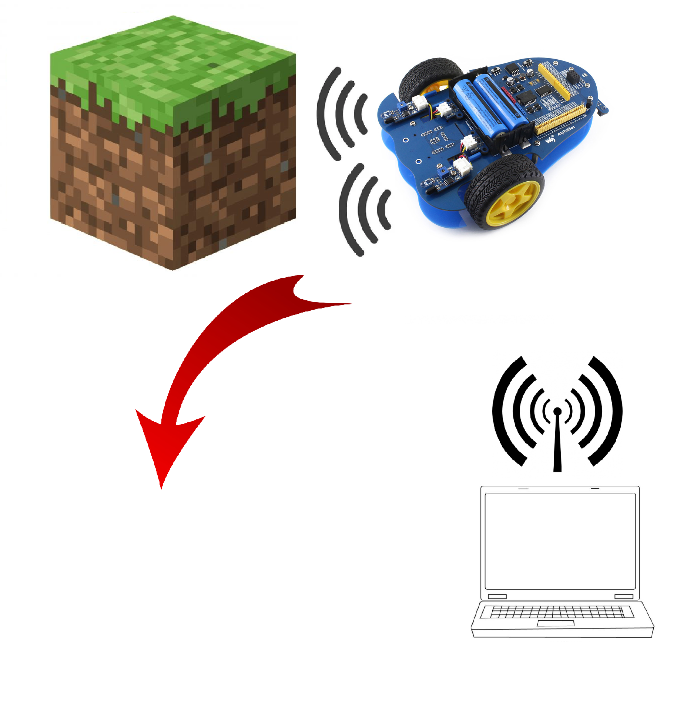

## Progetto ALPHA-BOT con WebAPI
# AlphAPI-BOBE

### TEAM:

Nome Alunno | Ruolo                                   
| - | - |
|Bongiovanni Daniele | Programmer
| Obertino Mattia | Programmer

### TECNOLOGIE UTILIZZATE: 

Python, Flask, Raspberry, SQLite, AlphaBot, WebAPI

### DESCRIZIONE:

L'obiettivo di questo progetto era quello di riuscire a controllare un Alphabot le WEB API.
Per lo sviluppo di questo progetto abbiamo instaurato una connessione TCP client-server tramite l'utilizzo di Rapberry-PI e la libreria Flask che permette di creare un web-server.

Nella prima pagina del sito bisogna loggarsi in modo che ogni comando che venga mandato sia salvato su un Database e sia riconducibile all'utente che l'ha effettuato.
