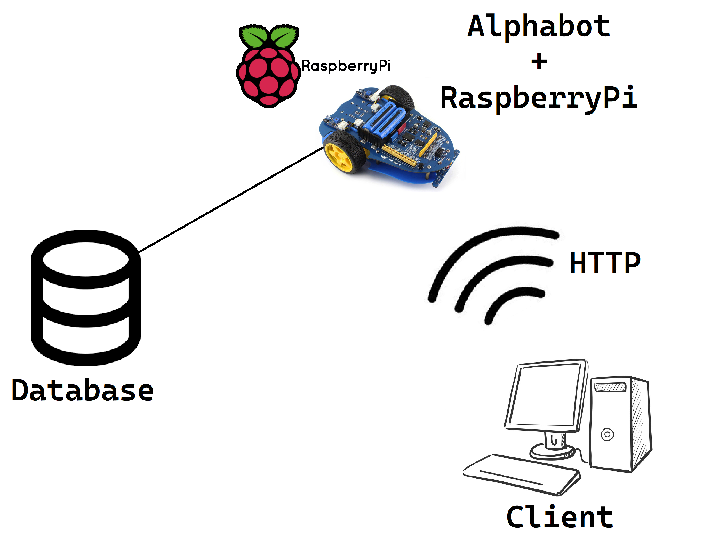
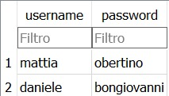
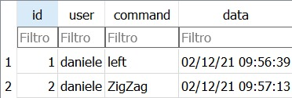
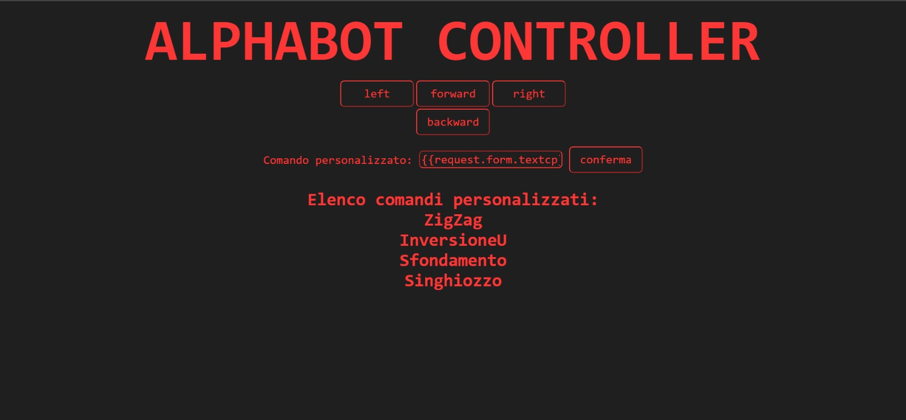
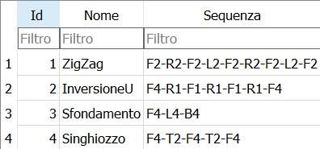

## Progetto TPSIT anno scolastico 2021-2022
# Alpha-BOBE

### TEAM:

Nome Alunno | Ruolo                                   
| - | - |
|Bongiovanni Daniele | Programmer / Designer
| Obertino Mattia | Programmer / Designer

### TECNOLOGIE UTILIZZATE: 

Python, Flask, Raspberry, SQLite, AlphaBot

### DESCRIZIONE:

L'obiettivo di questo progetto era quello di riuscire a controllare un Alphabot tramite un sito web.
Per lo sviluppo di questo progetto abbiamo instaurato una connessione TCP client-server tramite l'utilizzo di Rapberry-PI e la libreria Flask che permette di creare un web-server.

Nella prima pagina del sito bisogna loggarsi in modo che ogni comando che venga mandato sia salvato su un Database e sia riconducibile all'utente che l'ha effettuato.

Sul sito di controllo sono presenti i classici pulsanti di movimento (Avanti, Indietro, Destra, Sinistra) 
che tramite la connessione TCP inviasse al robot che movimento fare.
In un secondo momento abbiamo creato una seconda tabella sul DB in cui abbiamo inserito dei comandi composti
formati da una serie di movimenti semplici.

